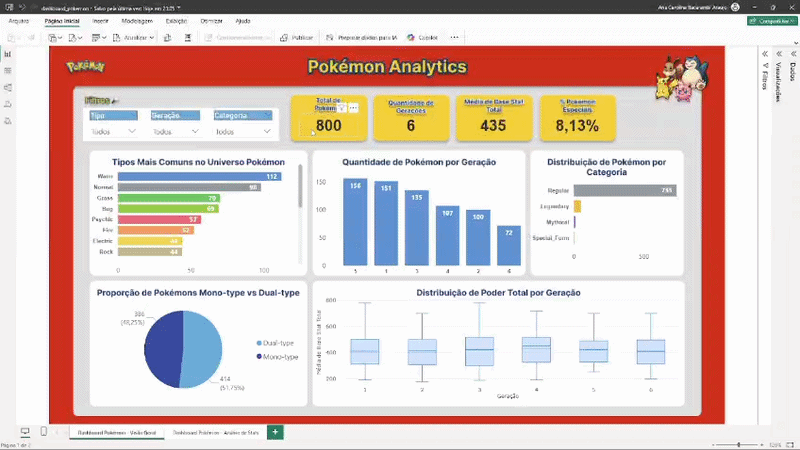
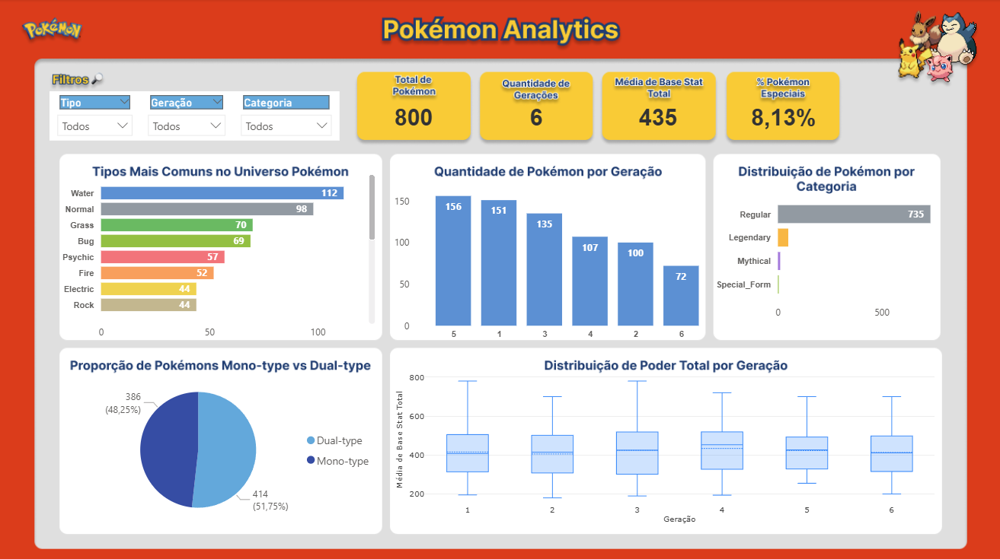
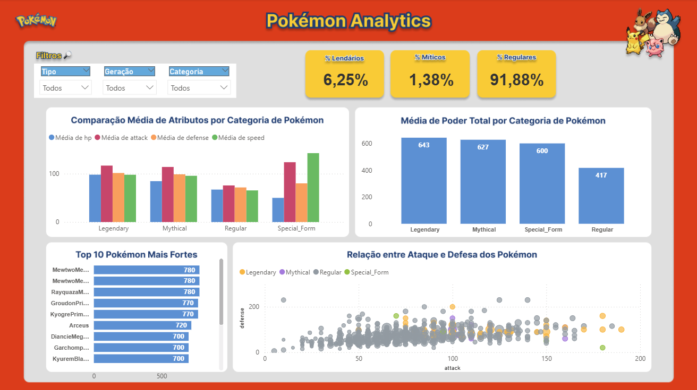

# 📊 Pokémon Analytics

Projeto de **Análise de Dados** desenvolvido a partir do dataset *Pokemon with stats* (Kaggle), com o objetivo de explorar informações de Pokémon das Gerações 1 a 6. 

🎯 Objetivo: analisar padrões e gerar insights sobre distribuição de tipos, evolução de poder entre gerações e diferenças estatísticas entre categorias de Pokémon.

## 🔹 Sobre o Dataset

O dataset contém informações de 721 Pokémon, incluindo formas alternativas e atributos de batalha.

📌 Colunas Originais
- ID (#)
- Name
- Type 1
- Type 2
- Total
- HP
- Attack
- Defense
- Sp. Attack
- Sp. Defense
- Speed
- Generation
- Legendary

📌 Colunas Criadas
- special_category → Classificação dos Pokémon em: lendário, mítico, forma alternativa e  regular.

---

## 🛠️ Tecnologias Utilizadas


- **SQL** & **PostgreSQL** → ETL, limpeza, transformação e modelagem dos dados
- **Power BI** & **DAX** → criação de métricas, KPIs e dashboard interativo
- **Figma** → prototipação do layout do dashboard

---

## 🔹 Arquitetura do Projeto

```
Kaggle (CSV)
     ↓
PostgreSQL (ETL + SQL)
     ↓
Power BI (DAX + Modelagem)
     ↓
Dashboard Interativo
```

Etapas:
- Extração do dataset (CSV)
- Limpeza e transformação no PostgreSQL
- Criação de colunas derivadas
- Importação para o Power BI
- Criação de medidas DAX e visuais
- Construção do dashboard final

---

## 📁 Estrutura do Projeto
```
pokemon-data-analysis/
│
├── data/
│   └── Pokemon.csv
│
├── sql/
│   └── etl_pokemon.sql
│
├── dashboard/
│   └── dashboard_pokemon.pbix
│
├── docs/
│   ├── dashboard_layout/
│   │   ├── Modelo1_Dashboard_Pokemon.png
│   │   └── Modelo2_Dashboard_Pokemon.png
│   ├── dashboard_page1.png
│   ├── dashboard_page2.png
│   └── dashboard.gif
│ 
└── README.md

```

---

## 🔹 ETL (PostgreSQL)

O processo de ETL foi realizado inteiramente no PostgreSQL, garantindo qualidade e consistência dos dados antes da análise.

### Principais Etapas

- Criação da tabela no PostgreSQL
- Importação do CSV (pgAdmin)
- Padronização e renomeação de colunas
- Tratamento de valores nulos
- Identificação de duplicidades
- Criação de colunas
- Geração de tabela final para análise

---

## 🔹 Dashboard (Power BI)



O dashboard foi desenvolvido com foco em análise exploratória e storytelling de dados, permitindo identificar padrões e comparações de forma intuitiva.

- Filtros disponíveis: Tipo de Pokémon, Geração e Categoria

💡 Esses filtros permitem ao usuário analisar subconjuntos específicos, como: comparar atributos apenas de Pokémon lendários, explorar diferenças entre gerações, analisar desempenho por tipo

### Página 1 - Visão Geral



**KPIs**
- Total de Pokémon
- Quantidade de Gerações
- Média de Base Stat Total
- % Pokémon Especiais

**Gráficos**
- Tipos Mais Comuns no Universo Pokémon  | Gráfico de Barras
- Quantidade de Pokémon por Geração | Gráfico de Colunas
- Distribuição de Pokémon por Categoria | Gráfico de Barras
- Proporção de Pokémon Mono-type e Dual-type | Gráfico de Pizza
- Distribuição de Poder Total por Geração | Gráfico Boxplot

### Página 2 - Análise de Stats



**KPIs**
- % Lendário
- % Mítico
- % Regulares

**Gráficos**
- Comparação Média de Atributos por Categoria de Pokémon | Gráfico de Colunas Clusterizado
- Média de Poder Total por Categoria de Pokémon | Gráfico de Colunas
- Top 10 Pokémon mais Fortes | Gráfico de Barras
- Relação entre Ataque e Defesa dos Pokémon | Gráfico Scatter Plot

---

## 💡 Principais Insights

### Distribuição Geral

- O tipo Água é o mais comum, sendo o mais representado entre todas as gerações analisadas
- A geração 5 possui o maior número de Pokémon
- A maioria absoluta dos Pokémon são regulares/comuns (91,88%), enquanto lendários e míticos representam ~8%, confirmando sua raridade no universo pokémon
- 51% dos Pokémon são dual-type, ou seja, possuem dois tipos elementares simultaneamente, o que amplia as possibilidades estratégicas em batalha

### Evolução de Poder
- A média de Base Stat Total se mantém relativamente estável entre gerações
- Não há evidência de aumento de poder significativo

### Categorias de Pokémon
- Pokémon lendários possuem média de 643 de poder total, contra 417 dos regulares
- Míticos seguem tendência semelhante, com alto desempenho

###  Formas Alternativas
- Pokémon com múltiplas formas podem aparecer mais de uma vez em rankings
- Cada forma possui atributos próprios, impactando diretamente o desempenho
- Isso evidencia a importância de considerar granularidade na análise (nível de forma vs nível de espécie)

**Observação:** Para evitar distorções causadas por múltiplas formas de um mesmo Pokémon (ex: Mega Evoluções), algumas métricas utilizam contagem distinta baseada no número da Pokédex.

---

## 📌 Principais Perguntas Respondidas

- Pokémon lendários são realmente mais fortes que os regulares?
- Existe aumento de poder ao longo das gerações?
- Quais tipos são mais predominantes?
- Como os atributos (hp, ataque, defesa, velocidade) se distribuem entre categorias?

---

## 👩‍💻 Sobre mim

Sou Tecnóloga em Sistemas para Internet em transição para a área de Dados, com foco em análise de dados.

Possuo experiência com SQL (PostgreSQL), Python (Pandas) e Power BI, desenvolvendo projetos de ETL, análise exploratória (EDA) e criação de dashboards interativos.

---

🩷 Fique à vontade para explorar o projeto, dar feedback ou entrar em contato!

---
## 📫 Contato

<p align="left">
    <a href="https://www.linkedin.com/in/ana-carolina-itacarambi-araujo/" target="_blank">
      
    </a>
</p>
